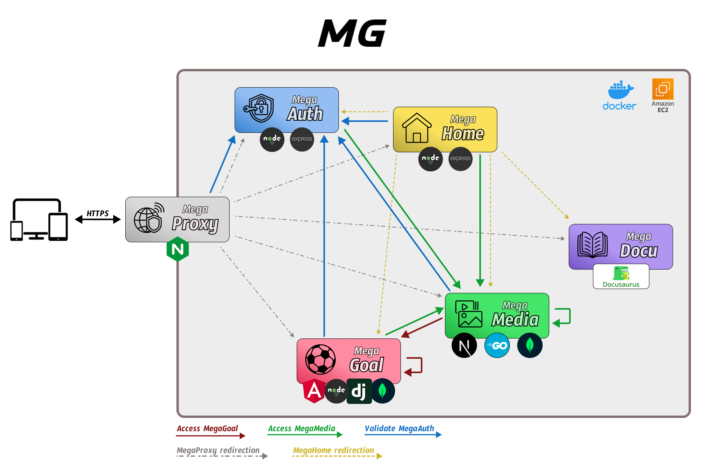

# Mega

Welcome to **Mega**. My personal project of web applications built with a **microservices architecture**.

I invite you to explore the code and see how everything works!

Everything is deployed in production. Feel free to contact me if you want to use it! :)

## Table of Contents

- [What is Mega](#what-is-mega)
- [Services](#services)
  - [MegaProxy](#megaproxy)
  - [MegaAuth](#megaauth)
  - [MegaGoal](#megagoal)
  - [MegaMedia](#megamedia)
  - [MegaHome](#megahome)
  - [MegaDocu](#megadocu)
- [General Deployment](#general-deployment)
- [Security](#security)
- [Web Access](#web-access)
- [Contact Information](#contact-information)

## What is Mega

The goal of this project is to learn, investigate and build different types of applications that I could use every day.

Microservices architecture is a perfect approach for this project. It allows me to build each service using the framework or programming language of my choice, giving me the opportunity to expand my knowledge in software development.The modularity and scalability are two other big reasons for choosing this architecture. And because it's called 'micro', I try to keep each microservice as small and efficient as possible while ensuring security.

In this repository you will find a general overview of the project and its services, and then in each service repository you will find a more detailed explanation of how it works and technologies used.

I repeat, is totally open source. You can use the code as you want, collab, or use the applications already deployed, you can contact with me and I create you an account!

*MegaGoal* is the main application, I recommend you to visit the repository.

The number and quality of the services and applications will increase. I want to introduce other techonologies, new services and features, try different protocol communications (even develop IoT services), use other data structures (with blockchain in the horizon)... I have a lot and exciting ideas coming to my mind! And you will see them here.

## Services

Sometimes I call them services, other times microservices. Some services are composed by other services and it's really difficult to measure when is micro and when is not.

For now, these are the different micro-services that form part of *Mega*:

### MegaProxy

Virtual proxy that handles all the https requests from Internet to whatever *Mega* service. It is built with **Nginx**. Only https traffic to the domain [https://megagera.com](https://megagera.com) and some subdomains is allowed.

- Repository: [MegaGera/MegaProxy](https://github.com/MegaGera/MegaProxy)

### MegaAuth

Authentication service. User management and validation API for the other services. Built with **Node.js** and **Express.js**. 

- Repository: [MegaGera/MegaAuth](https://github.com/MegaGera/MegaAuth)
- Available at: [https://megaauth.megagera.com](https://megaauth.megagera.com)

### MegaGoal

Football application to save your matches watched and get stats about your data.

It is composed by 5 services: **WebApp (Angular)**, **Server (Node.js)**, **Stats (Django)**, **Database (MongoDB)**, and **Updater (Python)**.

This is the main application were most work was done.

- Repository: [MegaGera/MegaGoal](https://github.com/MegaGera/MegaGoal)
- Available at: [https://megagoal.megagera.com](https://megagoal.megagera.com)

### MegaMedia

Application that serves media files (like images) to other services. It also has a web interface where the files can be added, updated or transformed.

It is composed by 3 services: **WebApp (Next.js)**, **Server (Go)**, and **Database (MongoDB)**.

- Repository: [MegaGera/MegaMedia](https://github.com/MegaGera/MegaMedia)
- Available at: [https://megamedia.megagera.com](https://megamedia.megagera.com)

### MegaHome

Home application that allows the user to navigate to another service.

- Repository: [MegaGera/MegaHome](https://github.com/MegaGera/MegaHome)
- Available at: [https://megagera.com](https://megagera.com)

### MegaDocu

Personal documentation application. In this application I write documentation about the tasks I'm doing with the different frameworks and programming languages.

I used the framework [Docusaurus](https://docusaurus.io/) for this service. The git repository is private.

## General Deployment

All the services are running in a **AWS EC2** machine inside **docker containers**. All the dockers are deployed in the same docker network, but only *MegaProxy* has an interface that goes out of the machine to the Internet. Each service has his own `Dockerfile` and `docker-compose.yml` files to handle the container easily.

## Security

AWS manages the deployment machine.

*MegaProxy* handles all the traffic. It approves or rejects the https requests.

*MegaAuth* auths users and their requests. Encrypted passwords, user session management with JWT and CORS protected.

Up-to-date certificates ensures https connections.

Do you think you can access and hack me? I bet you to do it! I want to keep it secure!

## Web Access

[https://megagera.com](https://megagera.com)

## License

All the microservices are licensed under GPL-3.0 license except MegaGoal

## Contact Information

- gera1397@gmail.com
- GitHub: [MegaGera](https://github.com/MegaGera)
